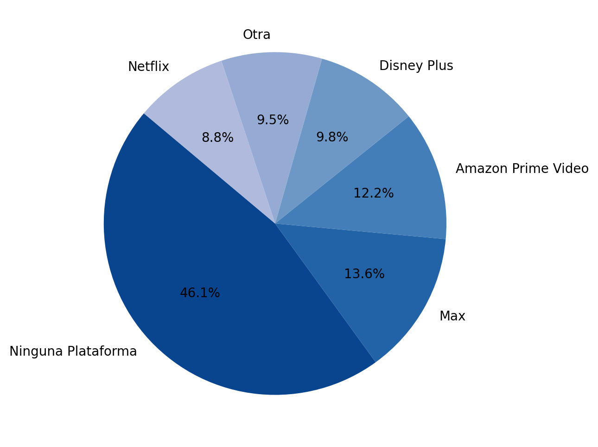
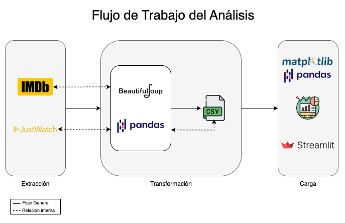

# Análisis: ¿En qué plataformas de streaming están disponibles las 250 mejores películas de IMDb en México?


Este análisis examina en qué plataformas de streaming en México con suscripción estándard se encuentran disponibles las **250 mejores películas de IMDb**. 
La información fue obtenida a través de **Web Scraping** desde IMDb y JustWatch para determinar la disponibilidad en servicios de streaming. 

**¿Qué ofrece este análisis?**
- **Visualizaciones interactivas** con Streamlit.
- **Listado de películas** y sus plataformas de streaming en México.
- **Estadísticas generales de la plataforma** como géneros más comunes, duración promedio y distribución por décadas.
- **Ranking de disponibilidad** por plataforma de streaming.

## Vista Previa del Dashboard

[Haz clic aquí para ver el Dashboard en Streamlit Cloud](https://imdbtop250platformanalysismx.streamlit.app/)

## Proceso ETL
Este proyecto sigue un proceso de **Extracción, Transformación y Carga (ETL)**:



## Consideraciones Generales
- Se excluyen películas que sólo están disponibles para **compra/renta**
- Sólo se consideran plataformas con **suscripciones estándard**
- Se descartan "Channels" de Amazon y otro canales secundarios para evitar falsos positivos.

## Objetivo del scraping
El objetivo es determinar en qué plataformas de streaming estándard (Netflix, Disney+, HBO Max, etc.) están disponibles las películas del Top 250 de IMDb en México, omitiendo opciones premium, channels o de renta/compra.

## Documentación Técnica
El detalle completo del scraping de IMDb y JustWatch, incluyendo las clases, etiquetas y lógica aplicada, se en el archivo:
[`/docs/scraping.md`](docs/scraping.md)


## Instalación y ejecución
**1. Clona este repositorio**
```bash
git clone https://github.com/soychriscampos/top250_platform_analysis_mx.git
cd top_platform_analysis_mx
```

**2. Instala dependencias**
```bash
pip install -r requirements.txt
```

**3. Ejecuta el ETL para obtener los datos**
```bash
python etl_pipeline.py
```
**4. Lanza el Dashboard en Streamlit**
```bash
streamlit run dashboard.py
```

## Contacto
**Autor:** [Christian Campos](https://x.com/soychriscampos)  
**Repositorio:** [Github](https://github.com/soychriscampos/imdbtop250_platform_analysis_mx.git)